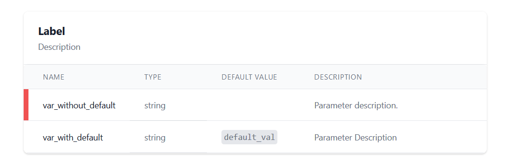

# LXCD

LXCD, short for Laravel x-Components Discovery, is a package aimed to make the new [Laravel Blade x-components](https://laravel.com/docs/7.x/blade#components) discoverable so you don't have to remember every single parameter. 


## Prerequisites

Before you begin, ensure you have met the following requirements:
* You are using Laravel 7.x or higher.
* You document your code with [phpDocumentor](https://www.phpdoc.org/) or no system at all.
* You haven't opted out of [Laravel's Package Discovery](https://laravel.com/docs/7.x/packages#package-discovery). If you have I'm assuming that you are able to register the package by yourself.

## Installation


```bash
composer require wulfheart/lxcd
```

## Usage

### Basic

LXCD hooks into phpDocumentor's in-code-documentation. To document your code add the following comment over your component class' `__construct` method.

```php
/**
     * Label
     * 
     * Description
     *
     * @param   string  $var_with_default  Parameter Description {@default default_val}
     * @param   string  $var_without_default     Parameter description.
     *
     */
    public function __construct(string $var_with_default = 'default_val', string $var_without_default)
    {
        #code...
    }
```

This will result in the documentation below:



You can access LXCD via `<your-app.url>/lxcd`. Please note that LXCD also discovers subfolders of your components.

### Advanced

If you are using a different base namespace for your components than `App\View\Components` or a different package installation location than `./vendor/wulfheart/lxcd` you may override LXCD's default settings via your `.env` file:
```env
LXCD_COMPONENTS_PATH = this\is\your\custom\path\to\your\components\root
LXCD_COMPONENTS_NAMESPACE = your\custom\base\namespace 
```

## Contributing
Pull requests are welcome. For major changes, please open an issue first to discuss what you would like to change.

If you experience any problems, bugs or have feature requests feel free to [open an issue](https://github.com/Wulfheart/lxcd/issues/new).

## Roadmap 🚧

- [ ] Make the blade component easily copiable
- [ ] Preview the component visually (this might be quite complicated 😅)
- [ ]  ❓ Make a [feature request](https://github.com/Wulfheart/lxcd/issues/new).

## Contact

Follow me on [Twitter](https://twitter.com/alexfwulf) or [open an issue](https://github.com/Wulfheart/lxcd/issues/new).

## License

This project is licensed under the MIT License. Please refer to the `LICENSE` file.
